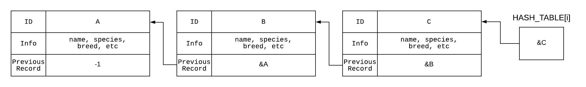

# **Vet Storage 🐹🦆🐈: A disk-based hash solution for accessing veterinary records**

## **About the project** 💬

### **_Made for the Operating Systems course at Universidad Nacional de Colombia in the second semester of 2019._**

Vet Storage is a client-server program written for the Operating Systems course. It's written in C using low-level POSIX functions, manual memory management, TCP sockets, threaded programming and mutex blocks.

The purpose of the program is to stablish a client-server connection between one server and up to 32 clients, each one connecting through a server thread.

The client is then able to perform CRUD actions (Create, Read, Update, Delete) on a randomly generated dataset of 10 million records, that makes up to 1 gigabyte of disk space. Each record consists of the attributes name, species, age, breed, height, weight, sex and a special attribute called **_previous_**. More on that later on.

Check [struct-generator.c](https://github.com/smg5284/vet-storage/blob/master/jleons-smondragon/struct-generator.c) for more details on the random generation of records.

Access to the data is done through a disk-based hash table, in order to avoid loading the whole dataaset into memory and making lookups quicker and computationally lighter. When a record is created, its name is hashed and the address of the start of the previous record with the same hash is written onto the **_previous_** field stated before. The new record address is then put into an array of size 1717.

This approach allows for 'reverse chaining' on the hash-table as shown on the following diagram.

The latest records of each hash code are stored in an int array on another file, which is loaded onto memory everytime the program is loaded.

The code only runs on Linux and its socket has only been tested through localhost. It can be compiled through `make all`, but you can also use `make client`; `make server` or `make generator` if you prefer to compile individual files.
